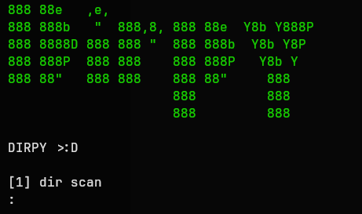

# DIRPY

<p align="center">
  
</p>

<h1 align="center">DIRPY</h1>

<p align="center">
  A lightweight directory enumeration tool written in Python.
</p>

<p align="center">


</p>

---

## About

**DIRPY** is a simple web directory enumeration tool developed in Python.

It performs HTTP GET requests against a target website using a wordlist and identifies possible directories and files based on HTTP response codes.

This project was created for **learning purposes, Python development, and web security studies**.

---

## Features

* Directory and file enumeration.
* HTTP/HTTPS support.
* Automatic URL scheme detection.
* Domain IP resolution.
* Web server detection using HTTP headers.
* Wordlist-based scanning.
* HTTP status code analysis.
* Colored terminal output.
* Request timeout protection.
* Error handling.

---

## HTTP Status Detection

| Status Code       | Meaning                         |
| ----------------- | ------------------------------- |
| `200`             | Directory or file found         |
| `301/302/307/308` | Redirect detected               |
| `403/405/501`     | Forbidden or protected resource |
| `404`             | Not found                       |

---

## Requirements

* Python 3.10+

Dependencies:

* requests
* colorama

---

## Installation

Clone the repository:

```bash
git clone https://github.com/yourusername/DIRPY.git
```

Enter the directory:

```bash
cd DIRPY
```

Install dependencies:

```bash
pip install -r requirements.txt
```

or:

```bash
pip install requests colorama
```

---

## Usage

Run the tool:

```bash
python3 dirpy.py
```

Select the scanner:

```
[1] dir scan
```

Enter the target:

```
Url: example.com
```

Enter your wordlist:

```
File name or path: wordlist.txt
```

DIRPY will start checking possible paths.

---

## Example Output

```text
*DIRPY 1.4
*Author Vortex
============================================================
TARGET INFORMATION

~ Site: https://example.com = [93.xxx.xxx.xxx]
~ Server: [nginx]

============================================================
METHOD GET

[+] Directory found /admin, status: 200

[~] Redirect page /login, status: 302

Forbidden/Unauthorized /private status: 403
```

---

## Project Structure

```
DIRPY/
│
├── dirpy.py
├── wordlist.txt
├── requirements.txt
├── README.md
└── assets/
    └── banner.png
```

---

## Technologies

* Python
* Requests
* HTTP Protocol
* Socket Programming
* Pathlib

---

## Future Improvements

* [ ] Multithreaded scanning.
* [ ] CLI arguments with argparse.
* [ ] Custom extensions support.
* [ ] Result export.
* [ ] Progress bar.
* [ ] WAF detection.
* [ ] Multiple target scanning.
* [ ] Better wordlist management.

---

## Disclaimer

DIRPY was created for **educational purposes only**.

Do not use this tool against systems without proper authorization.

The user is responsible for how this software is used.

---

## Author

**Vortex**

Developed for learning Python programming and cybersecurity.
